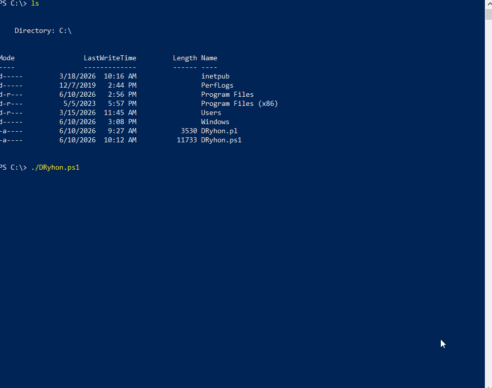
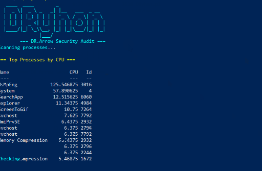
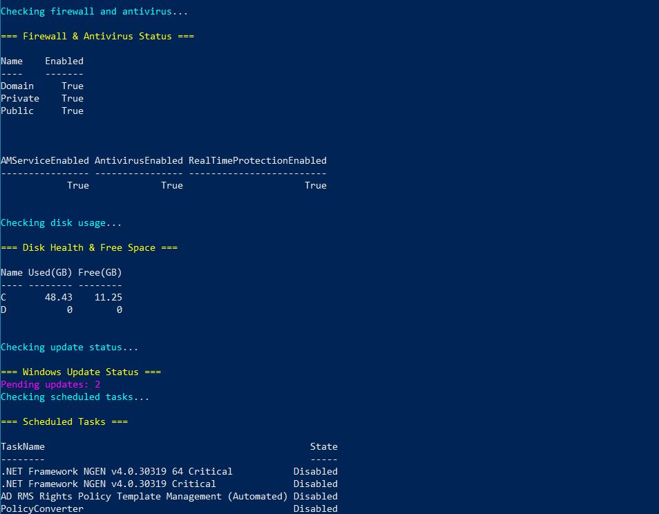
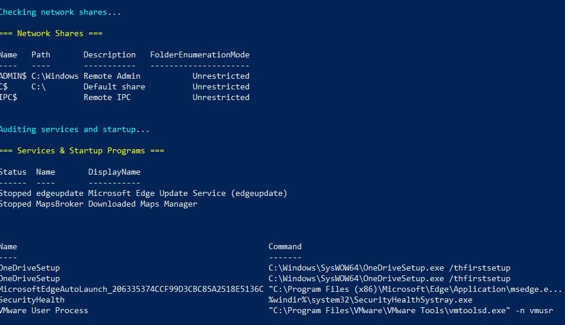
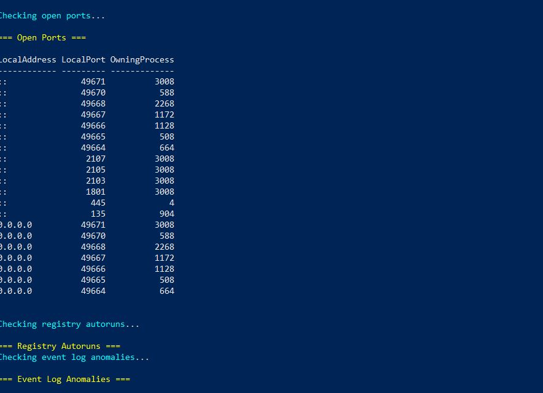
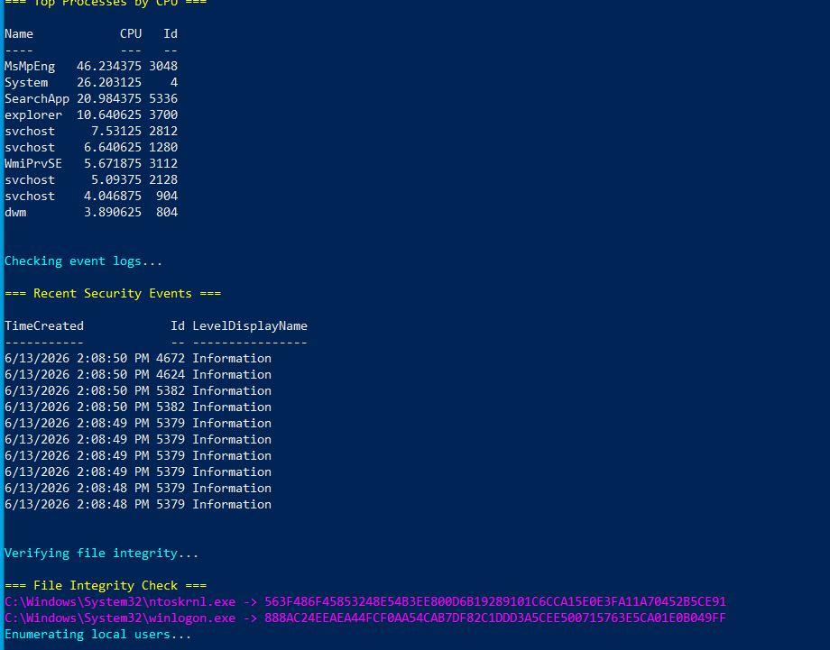

# 🛡️ DRyhon Security Audit

> A PowerShell-based Windows Security Auditing Framework created by **DrArrow** for rapid endpoint assessment and HTML-based security reporting.


---

## 🎬 Demo



---

## 📖 Overview

DRyhon is a lightweight Windows Security Auditing Framework developed in PowerShell. It helps security professionals, system administrators, and IT teams perform quick endpoint assessments by collecting security-relevant information and generating professional HTML reports.

The tool leverages native Windows and PowerShell capabilities, making it lightweight, portable, and free from third-party dependencies.

---

## ✨ Features

### 🔍 Process Analysis

* Displays the top CPU-consuming processes.
* Helps identify suspicious or resource-intensive applications.

### 📋 Security Event Monitoring

* Retrieves recent Windows Security Event Logs.
* Displays:

  * Event Timestamp
  * Event ID
  * Severity Level

### 🛡️ File Integrity Verification

Calculates SHA256 hashes for critical Windows system files:

* `C:\Windows\System32\ntoskrnl.exe`
* `C:\Windows\System32\winlogon.exe`

Useful for:

* Integrity verification
* Baseline comparisons
* Malware investigations

### 👤 User Account Auditing

Collects information about:

* Local user accounts
* Account status
* Last logon time

### ⚠️ Suspicious Account Detection

Identifies:

* Disabled accounts
* Recently active accounts

### 🌐 Network Connection Monitoring

Lists active TCP connections including:

* Local Address
* Local Port
* Remote Address
* Remote Port

### 🚨 Suspicious Port Detection

Monitors commonly abused ports:

| Port | Description                        |
| ---- | ---------------------------------- |
| 1337 | Potential Backdoor Activity        |
| 4444 | Reverse Shell / Testing Frameworks |

### 💻 System Information Collection

Collects:

* Computer Name
* Domain
* Manufacturer
* Model

### 📊 Professional HTML Reporting

Generates:

* Dark-themed reports
* Color-coded alerts
* Structured tables
* Easy-to-read security summaries

---

## 🚀 Project Highlights

* Pure PowerShell implementation
* No external dependencies
* Automated HTML report generation
* SHA256 file integrity monitoring
* Windows Security Event Log analysis
* User account auditing
* Network connection monitoring
* Suspicious port detection
* Professional report formatting
* MIT Licensed
* Created by DrArrow

---

## 📂 Project Structure

```text
DRyhon/
│
├── DRyhon.ps1
├── README.md
│
├── screenshots/
│   ├── dryhon-demo.gif
│   ├── banner.png
│   ├── report-overview.png
│   ├── processes.png
│   ├── security-events.png
│   ├── network-connections.png
│   └── file-integrity.png
│
└── reports/
```

---

## ⚙️ Requirements

### Operating Systems

* Windows 10
* Windows 11
* Windows Server 2016+
* Windows Server 2019+
* Windows Server 2022+

### PowerShell

* PowerShell 5.1 or later

### Permissions

Run PowerShell as **Administrator** for full functionality.

---

## 📥 Installation

Clone the repository:

```bash
git clone https://github.com/DrArrow/DRyhon-Security-Audit
cd DRyhon
```

Or download the PowerShell script directly.

---

## ▶️ Usage

Run the script from an elevated PowerShell session:

```powershell
powershell.exe -ExecutionPolicy Bypass -File .\DRyhon.ps1
```

---

## 📄 Sample Output

### Console Output

```text
=== DRyhon Security Audit ===

Collecting system information...
Analyzing security events...
Checking network connections...

Report saved to C:\AuditReports\DRyhon_20260611_120015.html

=== DRyhon Audit Completed - Stay Secure ===
```

---

## 📊 Generated Report Sections

The generated HTML report includes:

* Top Processes by CPU Usage
* Recent Security Events
* File Integrity Checks
* Local User Accounts
* Suspicious Accounts
* Active Network Connections
* Suspicious Ports
* System Information

---

## 📸 Screenshots

### Tool Startup



### HTML Report Overview


### Process Analysis



### Security Event Monitoring



### Network Monitoring



### File Integrity Verification



---

## 🎯 Use Cases

### Blue Team Operations

* Daily Security Audits
* Endpoint Monitoring
* Threat Hunting

### Incident Response

* Initial Host Triage
* Security Investigations
* Evidence Collection

### System Administration

* User Account Reviews
* Network Visibility
* System Health Monitoring

### Cybersecurity Education

* Security Labs
* PowerShell Learning
* Audit Demonstrations

---

## 🔮 Future Enhancements

Planned features include:

* Windows Defender Status Monitoring
* Scheduled Task Auditing
* Startup Program Analysis
* Service Enumeration
* Registry Auditing
* IOC Scanning
* PDF Report Export
* Email Notifications
* SIEM Integration
* Threat Intelligence Enrichment

---

## 👨‍💻 Author

### DrArrow

Cybersecurity Enthusiast | Security Researcher | IT Professional

DRyhon was developed to provide a fast, lightweight, and effective method for auditing Windows systems using native PowerShell capabilities.

---

## ⚠️ Disclaimer

This project is intended for:

* Defensive Security
* Security Auditing
* Educational Purposes
* System Administration

Users are responsible for ensuring compliance with all applicable laws, regulations, and organizational policies.

---

## 📜 License

MIT License

Copyright (c) 2026 DrArrow

Permission is hereby granted, free of charge, to any person obtaining a copy
of this software and associated documentation files (the "Software"), to deal
in the Software without restriction, including without limitation the rights
to use, copy, modify, merge, publish, distribute, sublicense, and/or sell
copies of the Software, and to permit persons to whom the Software is
furnished to do so, subject to the following conditions:

The above copyright notice and this permission notice shall be included in all
copies or substantial portions of the Software.

THE SOFTWARE IS PROVIDED "AS IS", WITHOUT WARRANTY OF ANY KIND, EXPRESS OR
IMPLIED, INCLUDING BUT NOT LIMITED TO THE WARRANTIES OF MERCHANTABILITY,
FITNESS FOR A PARTICULAR PURPOSE AND NONINFRINGEMENT. IN NO EVENT SHALL THE
AUTHORS OR COPYRIGHT HOLDERS BE LIABLE FOR ANY CLAIM, DAMAGES OR OTHER
LIABILITY, WHETHER IN AN ACTION OF CONTRACT, TORT OR OTHERWISE, ARISING FROM,
OUT OF OR IN CONNECTION WITH THE SOFTWARE OR THE USE OR OTHER DEALINGS IN THE
SOFTWARE.

